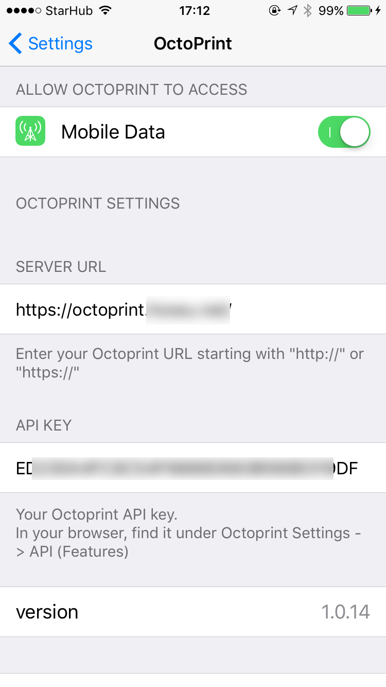
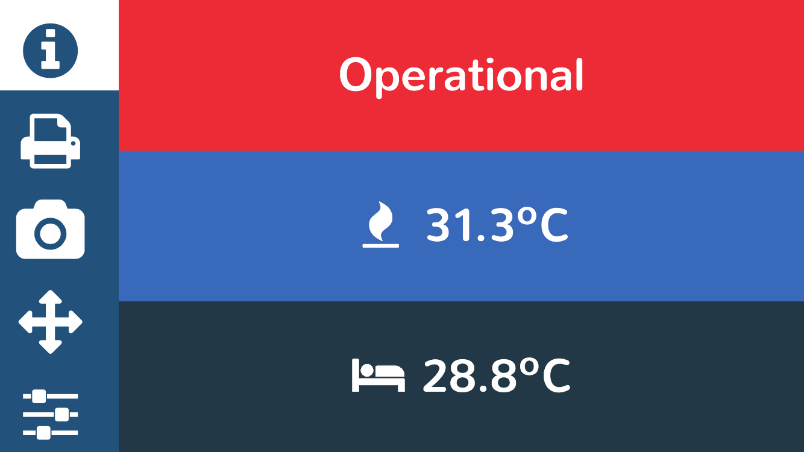
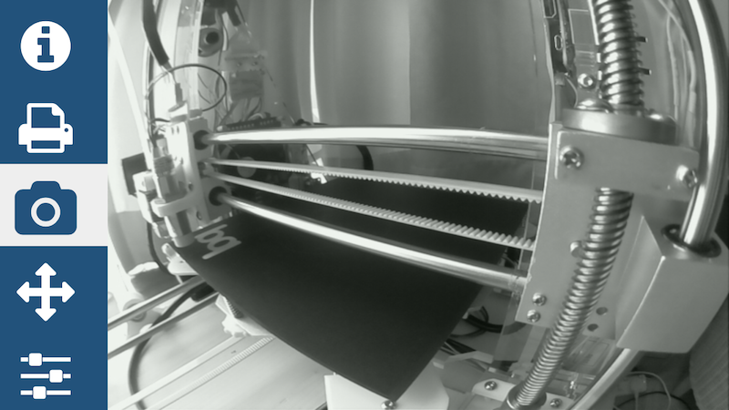
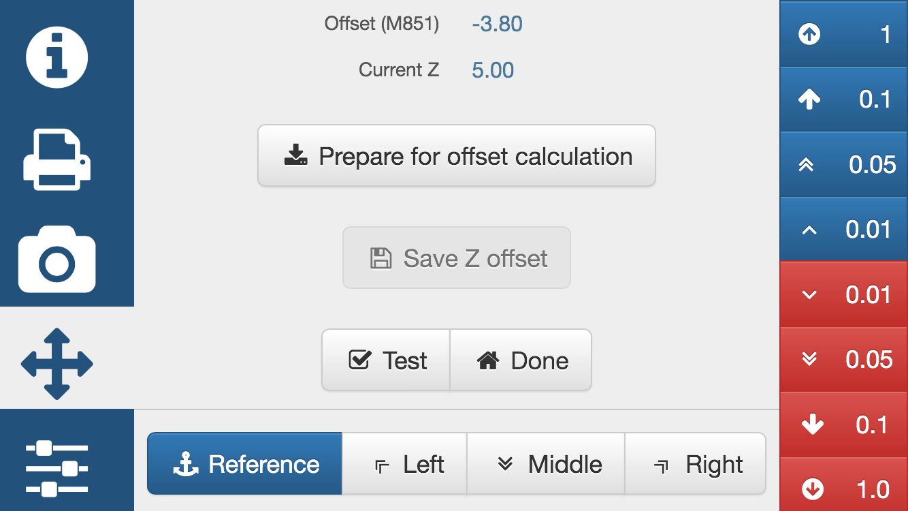

# OctoPrint-Mobile

Octoprint mini iPhone UI as iOS app and Octoprint UI plugin (only works on dev branch of Octoprint)

The iOS app is need only to force landscape, load the API key. Bonus feature: shake to refresh.

As long as octoprint is avalable over the internet, the UI changes to full screen webcam for pure monitoring. 

ios Settings

General printer info

Gereral printer commands

Webcam

The calibration screen. The main reason why this app was build - i got tired of moving my laptop :D 

Many more function can and will be added... 

###Setup

1. Manually install the plugin from `octoprint_mobile` to ~/.octoprint/plugins/mobile

2. Compile, sign and install the ios app. Free developer license from Apple needed.